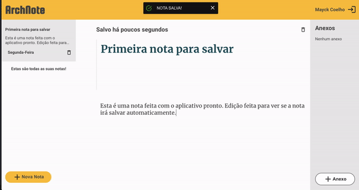

# Projeto ArchNote

Este repositório comtém o projeto de um aplicativo de notas rápidas, com a possibilidade de inclusão de anexos e salvamento automático

## Web

## Mobile

Tecnologias utilizadas:

 - ReactJS
 - TypeScript
 - NodeJS
 - MongoDB
 - Express
 - Styled Components
 - JWT